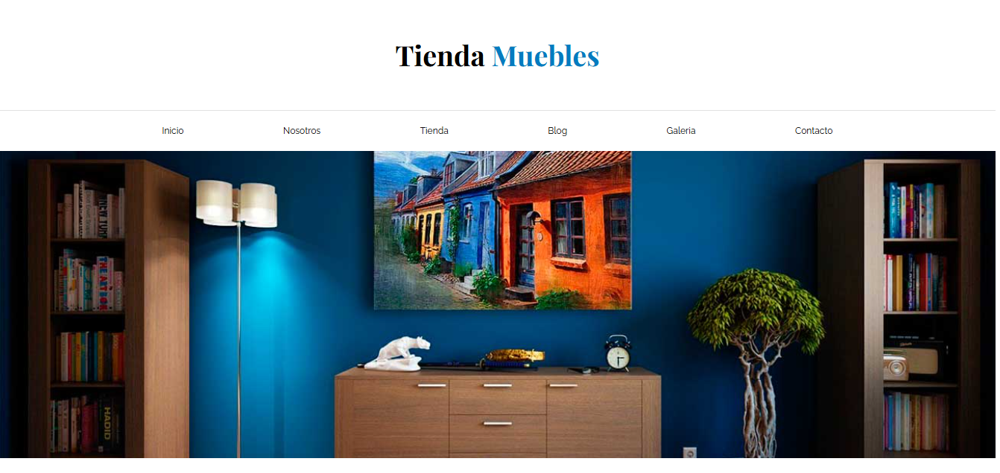

# Ecommerce de Muebles

Este repositorio contiene el primer proyecto del curso **"Aprende Flexbox, CSS Grid, Custom Properties, SASS, Mixins, Gulp Workflows, Animaciones, RWD y mucho más!"** de Udemy. El proyecto consiste en una tienda de muebles desarrollada como introducción al diseño y maquetación web utilizando HTML y CSS, con un enfoque en Flexbox y Grid.

## Vista Previa del Proyecto


## Descripción del Proyecto
El objetivo de este proyecto es construir un sitio web para una tienda de muebles que sea moderno, responsivo y estéticamente atractivo. Se puso especial énfasis en:

- La creación de un diseño adaptable que funcione en diferentes dispositivos.
- La utilización de técnicas avanzadas de maquetación con **Flexbox** y **CSS Grid**.

Este proyecto es un punto de partida para desarrollar habilidades fundamentales en diseño web y sentar las bases para el uso de tecnologías más avanzadas en proyectos futuros.

## Estructura del Proyecto
La estructura del proyecto es la siguiente:

```
Ecommerce/
├── index.html         # Archivo principal de la página
├── css/
│   └── styles.css     # Archivo principal de estilos
├── img/
│   └── ...            # Imágenes utilizadas en el proyecto
└── README.md          # Archivo descriptivo del proyecto
```

## Tecnologías Utilizadas
Este proyecto fue desarrollado utilizando las siguientes tecnologías:

- **HTML5**: Para la estructura del contenido.
- **CSS3**: Para el diseño y estilización.
- **Flexbox**: Para la creación de layouts flexibles.
- **CSS Grid**: Para la disposición de elementos en cuadrículas.

## Cómo Ver el Proyecto
1. Clona este repositorio:
   ```bash
   git clone https://github.com/tu-usuario/ecommerce-muebles.git
   ```
2. Abre el archivo `index.html` en tu navegador para visualizar el proyecto.

---
